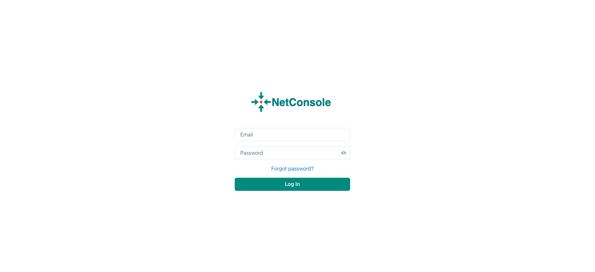
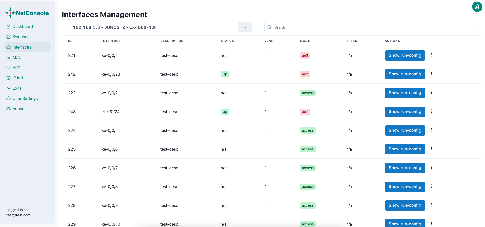
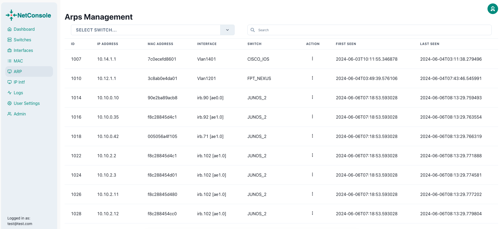
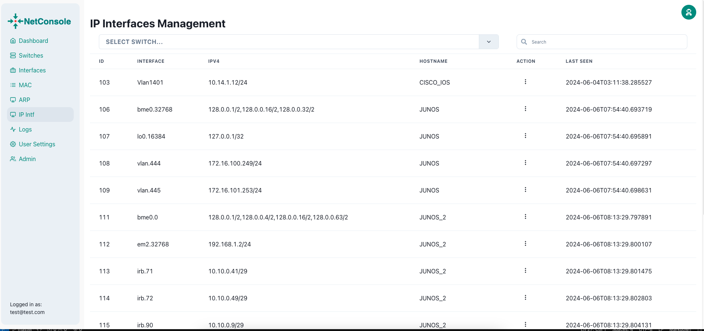
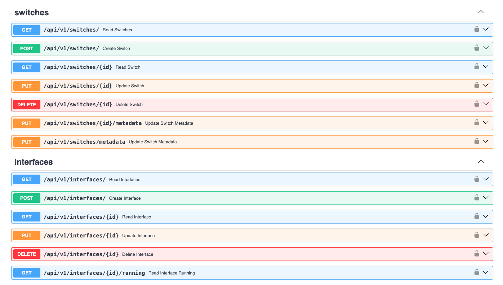

# Network Console Tool

## Technology Stack and Features

- ⚡ [**FastAPI**](https://fastapi.tiangolo.com) for the Python backend API.
- 🚀 [React](https://react.dev) for the frontend.
- 🐋 [Docker Compose](https://www.docker.com) for development and production.
- Features:
  - Switches: get system information. Support: Cisco IOS, Cisco Nexus, Juniper JUNOS
  - Interfaces: show running config, configure interface mode access|trunk, shutdown/no shutdown
  - Collect information: MAC, ARP, IP Interfaces and tracking first seen, last seen.
  - Apply config to multiple switches via nornir-netmiko: Group Config feature
  - Encrypted device credential storage

### Demo

- Video Demo: [https://youtu.be/HtHIZleYdnw](https://youtu.be/hVJTylnBLaw)
- Video giới thiệu netconsole: <https://youtu.be/ZD2K2Ue1MXk>
- Demo: <http://netconsole.9ping.cloud>
- Account: <demo@9ping.cloud> | ahjo2oop4hei9rieCaej

### Architecture

Overview
[](https://github.com/thangphan205/netconsole)
Backend-FastAPI
[](https://github.com/thangphan205/netconsole)

### Screenshots

[](https://github.com/thangphan205/netconsole)
[](https://github.com/thangphan205/netconsole)
[](https://github.com/thangphan205/netconsole)
[](https://github.com/thangphan205/netconsole)
[](https://github.com/thangphan205/netconsole)
[](https://github.com/thangphan205/netconsole)
[](https://github.com/thangphan205/netconsole)
[](https://github.com/thangphan205/netconsole)

---

## Prerequisites

- [Docker](https://docs.docker.com/engine/install/) + Docker Compose v2.22+
- Domain name (production only)

---

## Local Development

### 1. Clone

```bash
git clone https://github.com/thangphan205/netconsole
cd netconsole
```

### 2. Configure environment

```bash
cp .env.example .env
```

Edit `.env` and set required values:

| Variable | Description | Command to generate |
|----------|-------------|---------------------|
| `SECRET_KEY` | JWT signing key | `python3 -c "import secrets; print(secrets.token_urlsafe(32))"` |
| `FIRST_SUPERUSER_PASSWORD` | Admin password | _(choose a strong password)_ |
| `POSTGRES_PASSWORD` | Database password | `python3 -c "import secrets; print(secrets.token_urlsafe(32))"` |
| `CREDENTIAL_ENCRYPTION_KEY` | Fernet key for device credentials | `python3 -c "from cryptography.fernet import Fernet; print(Fernet.generate_key().decode())"` |

### 3. Build and start

```bash
docker compose build
docker compose up -d
```

| Service | URL |
|---------|-----|
| Web app | <http://localhost> |
| API docs | <http://localhost/docs> |
| DB admin | <http://localhost:8080> |
| Traefik dashboard | <http://localhost:8090> |

### 4. Development with file watch (hot reload)

```bash
docker compose watch
```

Backend Python changes sync instantly (uvicorn auto-reloads).
Frontend changes trigger a full rebuild.

### Stop

```bash
docker compose down
```

To also remove the database volume (wipes all data):

```bash
docker compose down -v
```

---

## Production Deployment

### Requirements

- Remote server with Docker installed
- DNS A record pointing your domain to the server IP
- Wildcard subdomain configured (e.g. `*.yourdomain.com`)

### 1. Set up Traefik reverse proxy (once per server)

```bash
# On the server — create public Docker network
docker network create traefik-public

# Copy Traefik config to server
rsync -a docker-compose.traefik.yml root@your-server.com:/root/code/traefik-public/

# On the server — set credentials and start Traefik
export USERNAME=admin
export PASSWORD=your-traefik-password
export HASHED_PASSWORD=$(openssl passwd -apr1 $PASSWORD)
export DOMAIN=yourdomain.com
export EMAIL=you@yourdomain.com

docker compose -f docker-compose.traefik.yml up -d
```

### 2. Deploy the app

```bash
# On the server
git clone https://github.com/thangphan205/netconsole
cd netconsole
cp .env.example .env
```

Edit `.env` — set `DOMAIN`, `ENVIRONMENT=production`, and all secret keys (see table above).

```bash
docker compose build
docker compose up -d
```

| Service | URL |
|---------|-----|
| Web app | `https://yourdomain.com` |
| API docs | `https://yourdomain.com/docs` |
| DB admin | `https://adminer.yourdomain.com` |
| Traefik dashboard | `https://traefik.yourdomain.com` |

### 3. CI/CD with GitHub Actions

The repo includes workflows for automated deployment.
See [deployment.md](./deployment.md) for full CI/CD setup instructions.

---

## Minimum Switch Configuration

### Cisco IOS

```
username netconsole privilege 15 secret <DEVICE_PASSWORD>
```

### Cisco Nexus

```
role name netconsole
  rule 4 permit read-write feature interface
  rule 3 permit read-write feature copy
  rule 2 permit read
  rule 1 permit command show running-config *

username netconsole password <DEVICE_PASSWORD> role netconsole
```

### Juniper JUNOS

```
set system login class read-only-all permissions view
set system login class read-only-all permissions view-configuration
set system login user netconsole class read-only-all
set system login user netconsole authentication plaintext-password
```
