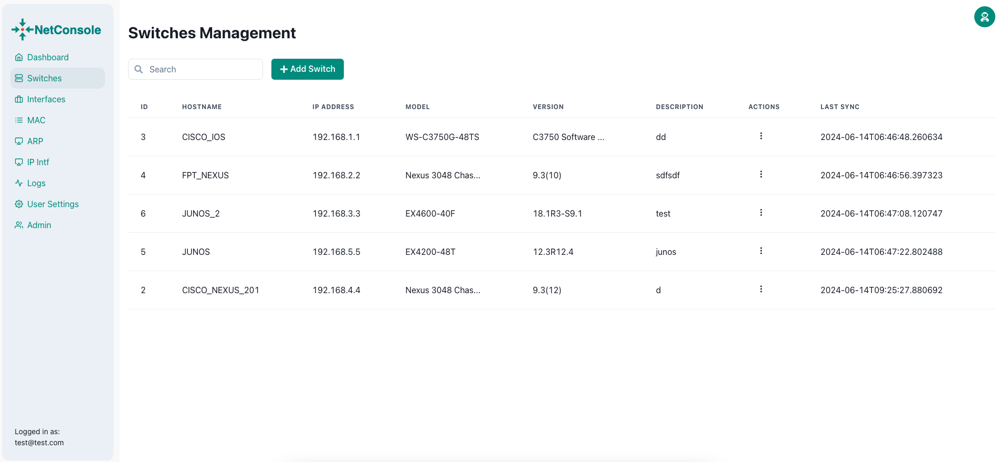
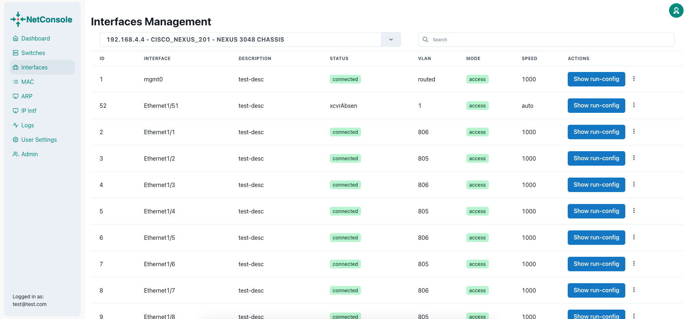
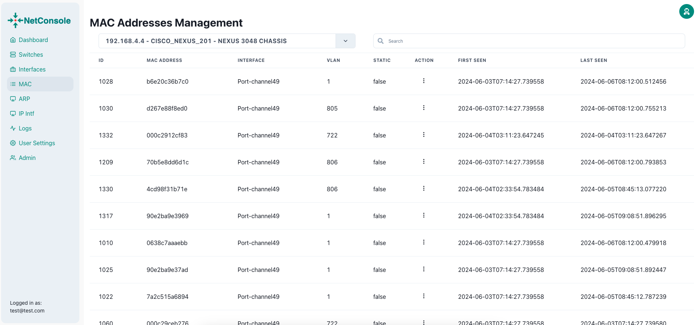
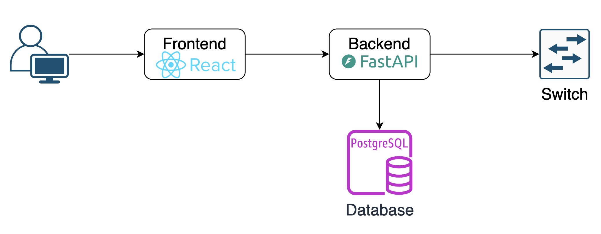
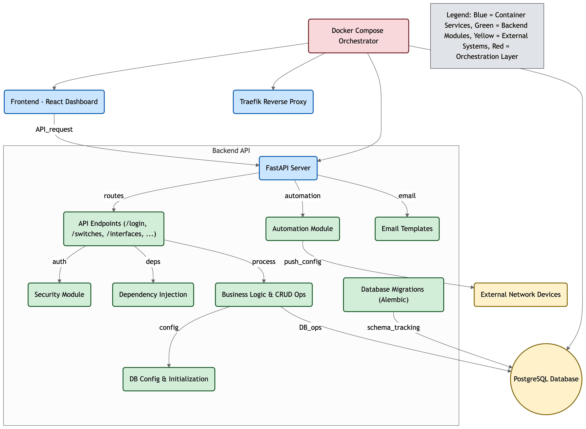

# NetConsole

<p align="center">
  <a href="https://fastapi.tiangolo.com"></a>
  <a href="https://react.dev"></a>
  <a href="https://nornir.tech"></a>
  <a href="https://modelcontextprotocol.io"></a>
  <a href="https://www.docker.com"></a>
  <a href="LICENSE"></a>
</p>

<p align="center">
  🌐 <strong>English</strong> | <a href="README.vi.md">Tiếng Việt</a>
</p>

---

**NetConsole** is a modern, enterprise-ready network automation and inventory management platform. Built to streamline network operations, it provides an intuitive React frontend and a powerful FastAPI backend to monitor, configure, and orchestrate network switches across multi-vendor environments.

### 🤖 AI-Agent Ready (Model Context Protocol)
NetConsole features native integration with the **Model Context Protocol (MCP)**. This exposes NetConsole's full REST API as secure tools to AI agents like **Claude Code**, **Claude Desktop**, and **Gemini CLI**. You can query network state, look up MAC/ARP tables, check device health, or push configurations using natural language commands.

---

## 🎥 Video Demos

*   📺 **2025 - Core Features Walkthrough**: [Watch Demo on YouTube](https://youtu.be/hVJTylnBLaw)
*   📺 **2026 - A-to-Z Deployment Guide**: [Watch Deployment Guide on YouTube](https://youtu.be/mz_sXdAkB3k)

---

## 📸 Screenshots & Architecture

<details>
<summary>🖥️ View UI Gallery (Dashboard, Switches, Interfaces, MACs)</summary>

### Modern Dark-Mode Dashboard


### Switch Inventory Management (Card & List Views)


### Interfaces Status & Configuration (Cisco / Juniper)


### MAC & ARP Tracking Tables (First Seen / Last Seen)

</details>

<details>
<summary>🏗️ Architecture & Network Topology Diagrams</summary>

### System Architecture Flow


### Network Deployment Topology

</details>

---

## 🚀 Key Features

*   🔌 **Multi-Vendor Driver Support**: Native integration for **Cisco IOS**, **Cisco NX-OS**, **Juniper JunOS**, and **Arista EOS** via NAPALM and Netmiko.
*   🖥️ **Interactive UI Dashboard**: Responsive design featuring light/dark themes, system health telemetry, real-time switch TCP status, and detailed search/filter operations.
*   🔍 **Automated State Tracking**: Background workers continuously sync and log MAC tables, ARP caches, and Layer 3 IP interface bindings.
*   ⚡ **High-Performance Group Config**: Dispatch commands in parallel to multiple target devices concurrently powered by **Nornir** automation tasks.
*   🔒 **Robust Enterprise Security**:
    *   **Fernet Encrypted Credentials**: Protect switch login credentials at rest.
    *   **Granular Scoped API Keys**: Issue read-only or read-write API keys for integrations and LLM agents.
    *   **Exhaustive Audit Logs**: Every state change or manual config push is timestamped and logged with user details and IP address.
*   📅 **Scheduler-Driven Automations**: Customize periodic intervals for switch syncs, health checks, and data collection.

---

## 🔌 Supported Platforms

| Platform | Driver | Interfaces | MAC / ARP / IP | Group Config |
|---|---|---|---|---|
| **Cisco IOS** | `ios` | ✅ | ✅ | ✅ |
| **Cisco NX-OS** | `nxos_ssh` | ✅ | ✅ | ✅ |
| **Juniper JunOS** | `junos` | ✅ | ✅ | ✅ |
| **Arista EOS** | `eos` | ✅ | ✅ | ✅ |

---

## 🛠️ Tech Stack

*   **Backend**: FastAPI, SQLModel (SQLAlchemy), PostgreSQL, Alembic (Migrations), APScheduler
*   **Network Automation**: Nornir, NAPALM, Netmiko
*   **Frontend**: React, Vite, Chakra UI, TanStack Router & Query
*   **Deployment**: Docker Compose, Traefik (with Let's Encrypt SSL/TLS)

---

## ⚙️ Prerequisites

*   [Docker](https://docs.docker.com/engine/install/) + Docker Compose v2.22+
*   A domain name with DNS A records (for Production Deployment)

---

## 💻 Local Development

### 1. Clone the Repository

```bash
git clone https://github.com/thangphan205/netconsole.git
cd netconsole
```

### 2. Configure the Environment

```bash
cp .env.example .env
```

Open `.env` and configure your credentials. You can generate secure secrets using these helpers:

| Variable | Description | Generation Helper Command |
|---|---|---|
| `SECRET_KEY` | JWT signing key | `python3 -c "import secrets; print(secrets.token_urlsafe(32))"` |
| `FIRST_SUPERUSER_PASSWORD` | Administrator initial password | *Choose a strong password* |
| `POSTGRES_PASSWORD` | PostgreSQL root database password | `python3 -c "import secrets; print(secrets.token_urlsafe(32))"` |
| `CREDENTIAL_ENCRYPTION_KEY` | Fernet key for encrypting credentials | `python3 -c "from cryptography.fernet import Fernet; print(Fernet.generate_key().decode())"` |

### 3. Build & Spin Up Services

```bash
docker compose build
docker compose up -d
```

| Service | Access URL |
|---|---|
| **NetConsole Web App** | [http://localhost](http://localhost) |
| **Interactive API Documentation** | [http://localhost/docs](http://localhost/docs) |
| **Database Administration (Adminer)** | [http://localhost:8080](http://localhost:8080) |

### 4. Apply Database Migrations

```bash
docker compose exec backend alembic upgrade head
```

### 5. Enable Development Hot-Reloading

```bash
docker compose watch
```

### Stopping Services

*   **Keep persistent data**: `docker compose down`
*   **Wipe database and volume data**: `docker compose down -v`

---

## 🤖 MCP Server (AI Agent Integration)

`mcp_server/` exposes NetConsole's REST API as standardized [MCP](https://modelcontextprotocol.io) tools. This allows AI agents (e.g., Claude Desktop, Claude Code) to retrieve network states, query credentials, check switch diagnostics, and push configs directly.

> [!WARNING]
> NetConsole's MCP server implements full Read/Write operations, including `push_group_config` which executes configurations directly on live production switches without dry-runs. Review [mcp_server/README.md](mcp_server/README.md) carefully before deployment.

### 1. Mint an API Key

1. Log in as a **superuser** to the NetConsole Web App.
2. Navigate to **API Keys** in the sidebar.
3. Click **+ Add ApiKey**, assign a name, and select a role (`Read-write` or `Read-only`).
4. Copy the generated key (it is displayed only once).

*Note: `Read-only` keys return a `403 Forbidden` response for modifying operations (POST/PUT/DELETE).*

#### Alternative: Generate API Key via Curl

```bash
TOKEN=$(curl -s -X POST http://localhost/api/v1/login/access-token \
  -H "Content-Type: application/x-www-form-urlencoded" \
  -d "username=<superuser-email>&password=<superuser-password>" \
  | python3 -c "import sys,json; print(json.load(sys.stdin)['access_token'])")

curl -s -X POST http://localhost/api/v1/api-keys/ \
  -H "Authorization: Bearer $TOKEN" -H "Content-Type: application/json" \
  -d '{"name":"claude-mcp","role":"read_write"}'
```

### 2. Configure & Execute MCP Server

```bash
cd mcp_server
uv sync
export NETCONSOLE_API_URL=http://localhost/api/v1
export NETCONSOLE_API_KEY=ncmcp_... # The key minted above
```

*   **Claude Code**: Already includes a pre-configured `.mcp.json` at the repository root. Just export the `NETCONSOLE_API_KEY` environment variable in your terminal and launch Claude Code.
*   **Claude Desktop**: Add a server definition to `claude_desktop_config.json`:
    ```json
    {
      "mcpServers": {
        "netconsole": {
          "command": "uv",
          "args": ["--directory", "/absolute/path/to/netconsole/mcp_server", "run", "python", "-m", "netconsole_mcp"],
          "env": {
            "NETCONSOLE_API_URL": "http://localhost/api/v1",
            "NETCONSOLE_API_KEY": "ncmcp_..."
          }
        }
      }
    }
    ```
*   **Gemini CLI**: Add to `.gemini/settings.json` (project) or `~/.gemini/settings.json` (global):
    ```json
    {
      "mcpServers": {
        "netconsole": {
          "command": "uv",
          "args": ["--directory", "mcp_server", "run", "python", "-m", "netconsole_mcp"],
          "env": {
            "NETCONSOLE_API_URL": "http://localhost/api/v1",
            "NETCONSOLE_API_KEY": "ncmcp_..."
          }
        }
      }
    }
    ```

For the complete list of tools, key management, and troubleshooting guides, see [mcp_server/README.md](mcp_server/README.md).

---

## 🚢 Production Deployment

### Requirements
*   A Linux server with Docker and Docker Compose installed.
*   A registered domain name pointing to your server's IP address.

### 1. Set Up Traefik Reverse Proxy (Once per server)

```bash
docker network create traefik-public

export USERNAME=admin
export PASSWORD=your-traefik-password
export HASHED_PASSWORD=$(openssl passwd -apr1 $PASSWORD)
export DOMAIN=yourdomain.com
export EMAIL=you@yourdomain.com

docker compose -f docker-compose.traefik.yml up -d
```

### 2. Deploy NetConsole

```bash
git clone https://github.com/thangphan205/netconsole.git
cd netconsole
cp .env.example .env
# Edit .env: Set DOMAIN, ENVIRONMENT=production, and configure all secure keys
docker compose build
docker compose up -d
docker compose exec backend alembic upgrade head
```

| Service | Public Access URL |
|---|---|
| **Web App** | `https://yourdomain.com` |
| **API Docs** | `https://yourdomain.com/docs` |
| **Database Admin** | `https://adminer.yourdomain.com` |
| **Traefik Dashboard** | `https://traefik.yourdomain.com` |

### 3. CI/CD Integration

For automated deployments via GitHub Actions, refer to [deployment.md](./deployment.md).

---

## 🔌 Minimum Switch Configuration

Ensure your managed switches are configured with appropriate access privileges:

### Cisco IOS / Arista EOS
```config
username netconsole privilege 15 secret <DEVICE_PASSWORD>
```

### Cisco NX-OS
```config
role name netconsole
  rule 4 permit read-write feature interface
  rule 3 permit read-write feature copy
  rule 2 permit read
  rule 1 permit command show running-config *

username netconsole password <DEVICE_PASSWORD> role netconsole
```

### Juniper JunOS
```config
set system login class netconsole-class permissions view
set system login class netconsole-class permissions view-configuration
set system login class netconsole-class permissions configure
set system login user netconsole class netconsole-class
set system login user netconsole authentication plaintext-password
```

### Arista EOS (With Enable Password)
If the device requires manual enable elevation:
```config
username netconsole privilege 15 secret <DEVICE_PASSWORD>
enable secret <ENABLE_PASSWORD>
```
Specify the enable password in the **Enable Password** field when creating credentials in NetConsole.
