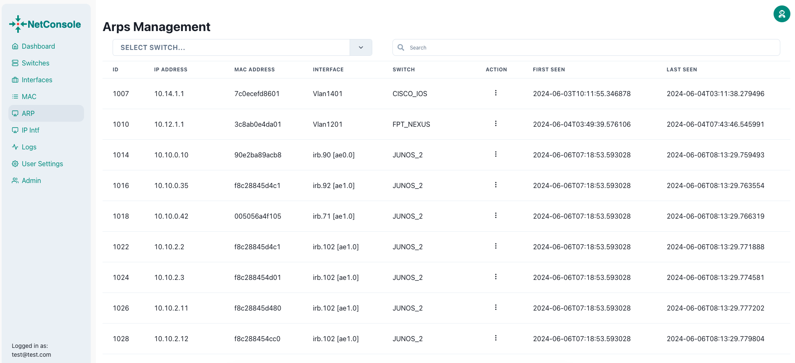
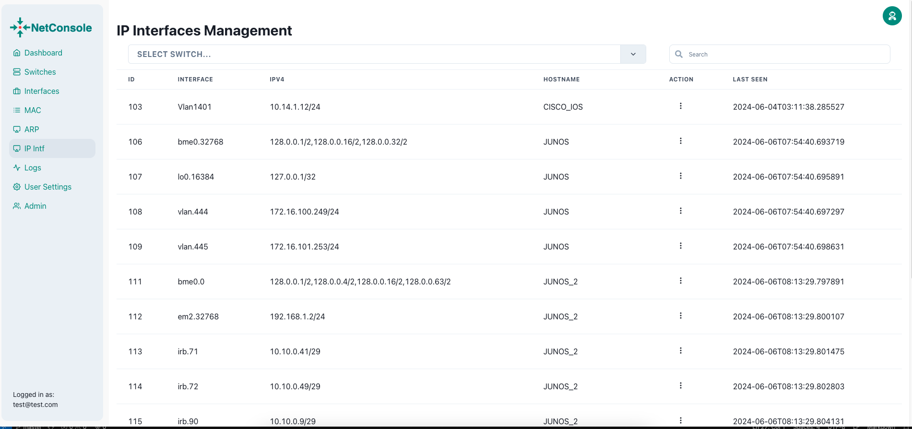

# Network Console Tool

## Technology Stack and Features

- ⚡ [**FastAPI**](https://fastapi.tiangolo.com) for the Python backend API.
- 🚀 [React](https://react.dev) for the frontend.
- 🐋 [Docker Compose](https://www.docker.com) for development and production.
- Features:
    - Switches: get system information. Support: Cisco, Juniper
    - Interfaces: show running config, configure interface mode access|trunk, shutdown/no shutdown
    - Collect information: MAC, ARP, IP Interfaces and tracking first seen, last seen.
    - Apply config multiple switches via nornir-netmiko: Group Config features

### Demo
- Video Demo: https://youtu.be/HtHIZleYdnw
- Demo: http://netconsole.9ping.cloud
- Account: demo@9ping.cloud | ahjo2oop4hei9rieCaej
### Dashboard Login

[](https://github.com/thangphan205/netconsole)

### Dashboard - Admin

[](https://github.com/thangphan205/netconsole)

### Dashboard - Interfaces

[](https://github.com/thangphan205/netconsole)
[](https://github.com/thangphan205/netconsole)
[](https://github.com/thangphan205/netconsole)
[](https://github.com/thangphan205/netconsole)
### Dashboard - MAC Address

[](https://github.com/thangphan205/netconsole)

### Dashboard - ARP

[](https://github.com/thangphan205/netconsole)

### Dashboard - IP interfaces

[](https://github.com/thangphan205/netconsole)


### Interactive API Documentation

[](https://github.com/thangphan205/netconsole)
[](https://github.com/thangphan205/netconsole)
[](https://github.com/thangphan205/netconsole)

## How To Use It


```bash
git clone https://github.com/thangphan205/netconsole
```

- Enter into the directory:

```bash
cd netconsole
```

### Configure

You can then update configs in the `.env` files to customize your configurations.

Before deploying it, make sure you change at least the values for:

- `SECRET_KEY`
- `FIRST_SUPERUSER_PASSWORD`
- `POSTGRES_PASSWORD`

You can (and should) pass these as environment variables from secrets.

Read the [deployment.md](./deployment.md) docs for more details.

### Generate Secret Keys

Some environment variables in the `.env` file have a default value of `changethis`.

You have to change them with a secret key, to generate secret keys you can run the following command:

```bash
python -c "import secrets; print(secrets.token_urlsafe(32))"
```

Copy the content and use that as password / secret key. And run that again to generate another secure key.
### Docker up and running
In the netconsole directory
```bash
docker compose build
docker compose up -d
```

Web access: http://localhost

API Docs: http://localhost/docs

DB admin: http://localhost:8080

traefik dashboard: http://localhost:8090
### Docker stop
```bash
docker compose down
```

### Minimun Switch configuration to work with netconsole.
- Cisco IOS: Tested WS-C3750G-48T
```bash
username netconsole privilege 15 secret changethis
```
- Cisco Nexus (read-only)
```bash
role name netconsole
  rule 4 permit read-write feature interface
  rule 3 permit read-write feature copy
  rule 2 permit read
  rule 1 permit command show running-config *

username netconsole password changethis role netconsole
```
- Juniper JUNOS (read-only)
```bash
set system login class read-only-all permissions view
set system login class read-only-all permissions view-configuration
set system login user netconsole class read-only-all
set system login user netconsole authentication plaintext <changethis>
```