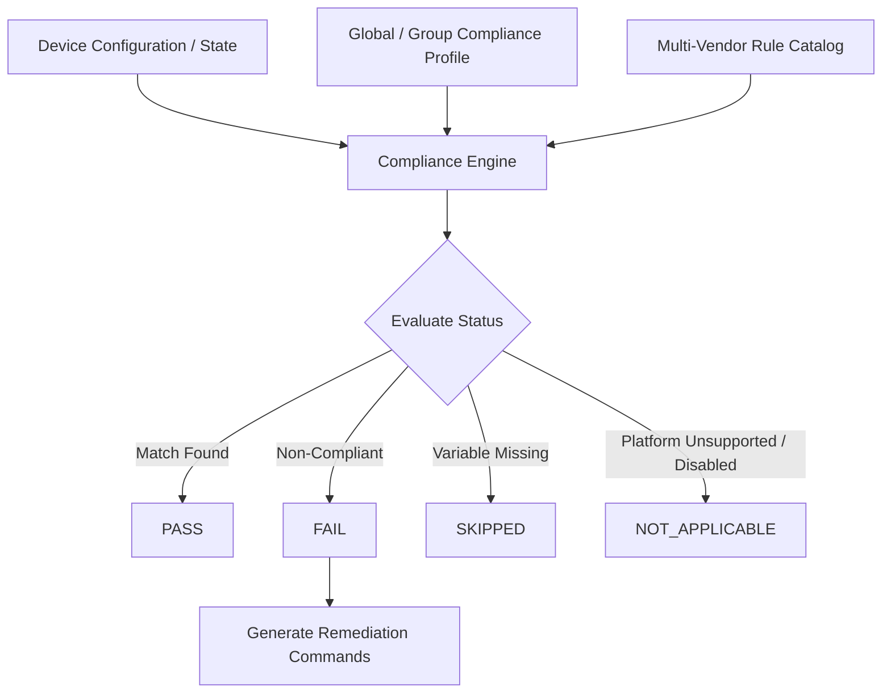

# Netconsole Compliance Management — User Guide

Welcome to the **Netconsole Compliance & Hardening Management** guide. Netconsole provides automated, multi-vendor compliance scanning, security baseline auditing, and one-click remediation across **Cisco IOS**, **Cisco NX-OS**, **Arista EOS**, and **Juniper JunOS** devices.

---

## 1. Core Architecture & Workflow

Netconsole continuously evaluates your network devices against industry security standards, including **PCI-DSS 4.0** and **ISO/IEC 27001:2022**.

---

## 2. Compliance Status Reference

| Status | Badge Color | Description |
| :--- | :--- | :--- |
| **`PASS`** | 🟢 Green | The device configuration strictly matches the hardening rule requirements. |
| **`FAIL`** | 🔴 Red | The device is missing required security configurations or contains insecure settings. Remediation commands are available. |
| **`SKIPPED`** | 🟡 Yellow | A required compliance variable (e.g., NTP server IP) is unconfigured in the active Compliance Profile. |
| **`NOT_APPLICABLE`** | ⚪ Grey | The rule is not supported on the target platform (e.g., NX-OS-only rules on IOS) or has been **disabled/bypassed by an operator**. |

---

## 3. Compliance Profiles & Overrides

Compliance profiles supply the dynamic variables (IP addresses, thresholds, policy parameters) required by compliance rules.

### A. Global Profile
The **Global Profile** establishes organization-wide baseline defaults used across all network devices:
- **NTP Servers**: Comma-separated list of required NTP servers (e.g., `10.0.0.1, 10.0.0.4`).
- **Syslog Servers**: Comma-separated list of central logging targets (e.g., `10.0.0.2, 10.0.0.5`).
- **DNS Servers**: Name servers required for name resolution.
- **Password Min Length**: Minimum required local password length (default: `12`).
- **Exec Timeout (minutes)**: Maximum allowed idle CLI session timeout (default: `10`).
- **Disabled Rules (Bypass)**: Comma-separated list of rule IDs to bypass (e.g., `PWD-02, SNMP-01`).

### B. Group Profile Overrides
Different device groups (e.g., `Datacenter-Switches` vs `Branch-Routers`) often require specific infrastructure servers or policy exemptions.
1. Navigate to **Compliance** → **Compliance Profiles** → **Group Overrides**.
2. Select a device group.
3. Configure group-specific fields. Any field left blank automatically inherits the global baseline value.

### C. Disabling & Bypassing Rules (`NOT_APPLICABLE`)
If a security command is unsupported by a specific hardware model/image (such as `security passwords min-length` on Cisco IOL images) or exempted by company policy:
1. Open **Compliance Profiles** (Global or Group Override).
2. Enter the Rule ID(s) in **Disabled Rules (Bypass)** (e.g., `PWD-02`).
3. Save the profile. The compliance engine will report the status as **`NOT_APPLICABLE`** with evidence `"Rule disabled in compliance profile"`.

---

## 4. Built-in Security Rule Catalog

| Rule ID | Title | Severity | Standards | Key Requirements |
| :--- | :--- | :--- | :--- | :--- |
| `NTP-01` | NTP Server Configured | **High** | PCI 10.6.1, ISO A.8.15 | Verifies configured NTP time sources match profile IPs. |
| `LOG-01` | Centralized Syslog Configured | **High** | PCI 10.2.1, ISO A.8.15 | Verifies syslog remote logging hosts match profile IPs. |
| `LOG-02` | Millisecond Timestamps Enabled | **Medium** | PCI 10.6.2, ISO A.8.15 | Enforces `service timestamps log datetime msec`. |
| `DNS-01` | Authorized Domain Name Server | **Medium** | PCI 1.3.1, ISO A.8.20 | Verifies configured `ip name-server` addresses. |
| `SSH-01` | SSH Version 2 Enforced | **High** | PCI 2.2.4, ISO A.8.24 | Checks `ip ssh version 2` or operational `show ip ssh` state. |
| `VTY-01` | Insecure Protocols Disabled (VTY) | **High** | PCI 2.2.4, ISO A.8.24 | Enforces `transport input ssh` on VTY lines (`line vty 0 4`). |
| `HTTP-01` | HTTP Web Server Disabled | **High** | PCI 2.2.4, ISO A.8.24 | Ensures unencrypted HTTP server is disabled (`no ip http server`). |
| `PWD-01` | Password Encryption Enabled | **High** | PCI 8.3.6, ISO A.5.17 | Enforces reversible password encryption (`service password-encryption`). |
| `PWD-02` | Password Minimum Length | **High** | PCI 8.3.6, ISO A.5.17 | Enforces local password length thresholds. |
| `PWD-03` | Password Strength Checking | **Medium** | PCI 8.3.6, ISO A.5.17 | Checks platform password complexity features (NX-OS). |
| `TIMEOUT-01`| Idle EXEC Timeout Configured | **Medium** | PCI 8.2.8, ISO A.8.18 | Checks VTY/Console idle timeout via config & operational `show line vty 0`. |
| `LOGIN-01` | Login Brute-Force Block | **High** | PCI 8.3.4, ISO A.8.5 | Enforces `login block-for` rate limiting on failed auth attempts. |
| `BANNER-01` | Security Login Banner | **Low** | PCI 2.2.4, ISO A.5.10 | Ensures legal warning banner (`banner motd`) is configured. |
| `AAA-01` | AAA Services Enabled | **Critical**| PCI 8.2.1, ISO A.5.15 | Verifies AAA framework is active (`aaa new-model`). |
| `SNMP-01` | Default SNMP Communities | **High** | PCI 2.2.4, ISO A.8.24 | Ensures default communities (`public`/`private`) are absent. |
| `SNMP-02` | SNMPv3 Enforced | **Medium** | PCI 2.2.4, ISO A.8.24 | Ensures legacy SNMP v1/v2c configurations are disabled. |

---

## 5. Running Compliance Audits & Remediation

### Running a Scan
- **Single Device**: Open a device in **Device Inventory** → click **Run Compliance Check**.
- **Batch Scan**: Navigate to **Compliance Dashboard** → click **Run Compliance for Group** or **Audit All Devices**.

### Reviewing Evidence & Remediation Preview
1. Click on a device's compliance result to view detailed evidence.
2. For any **`FAIL`** result, Netconsole displays the exact missing configuration lines alongside the recommended remediation commands.
3. Click **Preview Remediation** to review all CLI commands before execution.
4. Click **Apply Remediation** to push configuration fixes over SSH/API. Netconsole will automatically rerun compliance after pushing to confirm `PASS` status.

---

## 6. Best Practices

> [!TIP]
> **Use Group Overrides for Environment Isolation**
> Keep your Global Profile lean and use Group Profiles for location-specific NTP/Syslog IP addresses.

> [!IMPORTANT]
> **Operational State Support for Default Commands**
> Commands that default to active (e.g. Cisco's default 10-minute VTY idle timeout or active SSH v2 state) are verified by Netconsole using operational state commands (`show ip ssh`, `show line vty 0`), ensuring accurate pass rates even when commands do not appear in `show running-config`.
